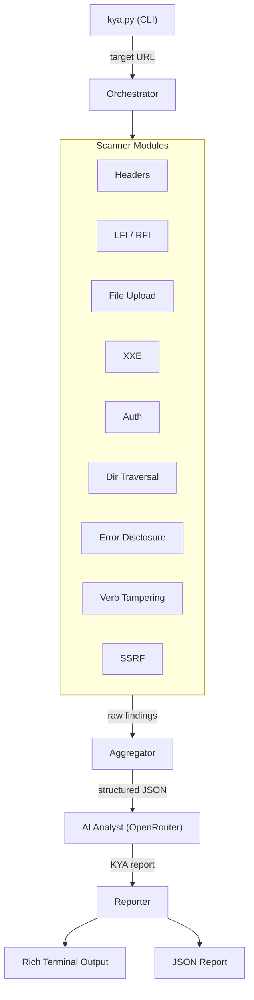

# KYA -- Know Your Adversary

> The best person to lock a door is the one who knows how to pick it.

---

## About This Project

KYA is a Python-based web application security auditor I built to apply offensive security techniques learned through [Hack The Box](https://www.hackthebox.com/) CBBH (Certified Bug Bounty Hunter) coursework. Instead of just learning how to exploit vulnerabilities in HTB labs, I reversed the tradecraft -- every scanner module in this tool is grounded in a real attack technique I studied, and every finding maps to a concrete defensive hardening control.

The goal: demonstrate that understanding how attackers think is the foundation for building systems that stop them.

---

## Skills Demonstrated

- **Web application security testing** -- hands-on knowledge of OWASP Top 10 attack vectors from HTB CBBH labs
- **Offensive-to-defensive methodology** -- translating exploitation techniques into actionable hardening controls
- **Python tool development** -- modular CLI application with abstract base classes, dataclass models, and structured output
- **AI/LLM prompt engineering** -- designed a structured prompt pipeline that maps raw scan data to OWASP/CWE classifications and produces actionable reports
- **API integration** -- OpenRouter (OpenAI-compatible SDK) for model-agnostic AI analysis
- **Security reporting** -- terminal and JSON report generation with severity-prioritized findings

---

## Architecture



Each scanner module inherits from `BaseScanModule`, runs independently against the target, and returns a list of `Finding` objects. The AI analyst receives all findings and produces an offense-to-defense report mapping each vulnerability to its exploit path, OWASP category, CWE, and the specific hardening control that closes the vector.

---

## What It Checks

| Module | Attack Vector | CBBH Source | What I Learned |
|---|---|---|---|
| Headers | Missing CSP, HSTS, X-Frame-Options, X-Content-Type-Options | LFI/Upload Prevention | How missing headers enable XSS payload execution, clickjacking, and MIME-type confusion in upload attacks |
| LFI/RFI | Path traversal, `php://filter` wrappers, `....//` filter bypass | Module 16: File Inclusion | Bypassing non-recursive `str_replace('../','')` with nested payloads; reading PHP source via base64 filter wrapper |
| Traversal | Encoded traversal (`%2e%2e%2f`, double-encoded `%252F`) | Module 16: Basic Bypasses | URL encoding bypasses filters that check raw input before decoding; double encoding defeats single-decode sanitization |
| File Upload | Extension blacklist fuzzing (`.phtml`, `.phar`, `.php5`) | Module 11: File Upload Attacks | Blacklists always miss edge cases -- `.phtml` executes as PHP but isn't in most blacklists; whitelists are the only real fix |
| XXE | DTD external entity injection (`<!ENTITY xxe SYSTEM "file:///etc/passwd">`) | Module 15: Web Attacks | XML parsers process external entities by default in outdated libraries; the fix is config-level, not code-level |
| Auth | Default creds, session token entropy, base64 role tampering | Module 14: Broken Authentication | Session tokens encoding `role=user` in base64 can be decoded, modified to `role=admin`, and re-encoded for privilege escalation |
| Verb Tampering | OPTIONS enumeration, HEAD bypass of auth-restricted endpoints | Module 15: HTTP Verb Tampering | Auth checks applied only to GET/POST leave HEAD wide open -- server config and app code must both restrict methods |
| SSRF | URL param injection targeting `http://169.254.169.254/` (cloud metadata) | Module 12: Server-side Attacks | SSRF to the AWS metadata endpoint returns IAM credentials -- one request to full cloud compromise |
| Error Disclosure | Triggering 4xx/5xx to surface stack traces, PHP errors, SQL errors | Throughout CBBH | Error messages reveal exact file paths (calibrates LFI traversal depth) and database types (tailors SQLi payloads) |

---

## AI-Powered Analysis Pipeline

I built a structured prompt pipeline that takes raw scanner output and produces actionable security reports. This is not "ask the AI what to do" -- the system prompt I designed enforces a specific output schema grounded in CBBH methodology:

1. **Structured input** -- scanner findings are serialized to JSON with evidence, raw request/response data, and severity classifications
2. **Offense-to-defense system prompt** -- instructs the model to reason as an attacker: assess real exploitability, describe the full attack chain, map to OWASP/CWE, and cite the specific CBBH hardening control
3. **Schema-enforced output** -- the model returns a JSON array with exact keys (`severity`, `exploit_path`, `owasp_category`, `cwe`, `cbbh_module`, `hardening_control`, `prevention_layers`)
4. **Fallback handling** -- if the model returns malformed output, the pipeline falls back to raw findings without crashing

Model-agnostic via [OpenRouter](https://openrouter.ai) -- works with Claude, GPT, Gemini, or any model on the platform. Default: `anthropic/claude-haiku-4-5`.

---

## Built With

| Tool | Purpose |
|---|---|
| Python 3.11+ | Core language |
| `requests` | HTTP scanning and payload delivery |
| `beautifulsoup4` | HTML parsing for form/upload/login detection |
| `click` | CLI framework with flags and argument parsing |
| `rich` | Terminal formatting (severity-colored panels, tables) |
| `openai` | OpenRouter API client (OpenAI-compatible SDK) |
| `python-dotenv` | Environment variable management |

---

## Usage

```bash
# Basic scan
python kya.py https://target.com

# Save report to JSON
python kya.py https://target.com --output report.json

# Use a different AI model
python kya.py https://target.com --model openai/gpt-4o-mini

# Run specific modules only
python kya.py https://target.com --modules headers,lfi,auth

# Skip AI analysis, show raw findings only
python kya.py https://target.com --no-ai
```

Run `python kya.py --help` for all options.

---

## Setup

```bash
git clone https://github.com/KoSGHOST7S/KYA----Know-Your-Adversary.git
cd KYA----Know-Your-Adversary

python3 -m venv .venv
source .venv/bin/activate
pip install -r requirements.txt

cp .env.example .env
# Add your OPENROUTER_API_KEY to .env
```

---

## Legal Disclaimer

**Only audit web applications you own or have explicit written permission to test.**
Unauthorized scanning is illegal. KYA is designed for authorized security assessments and learning environments only.

---

## Roadmap

- [x] Web application audit modules (9 scanners)
- [x] AI-powered offense-to-defense reporting
- [ ] Network hardening module
- [ ] Privilege escalation mitigation module
- [ ] Wireless hardening module
- [ ] Automated audit scheduling and reporting
- [ ] HTML report export

---

*Harden like you've already been breached.*
